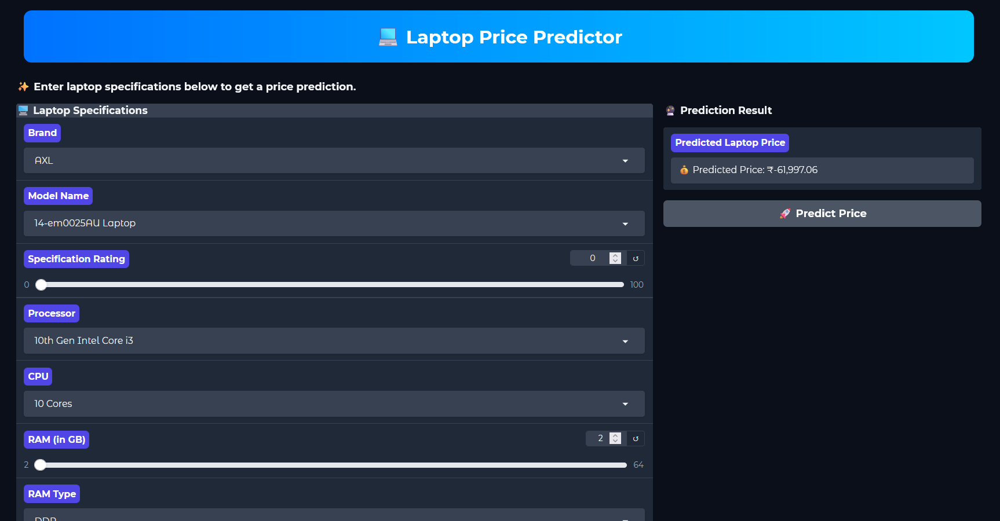
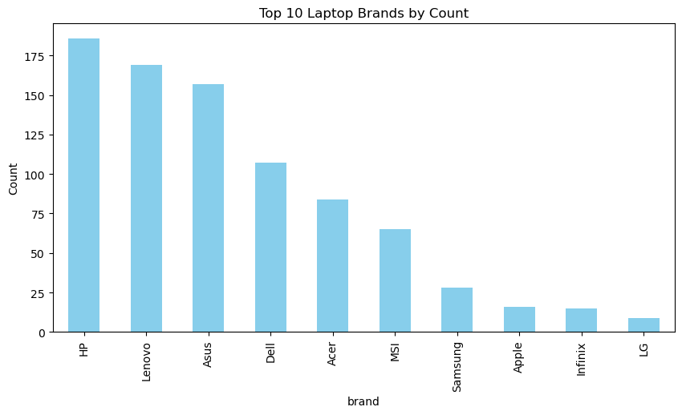
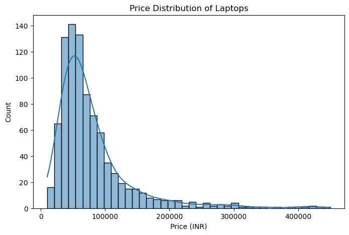
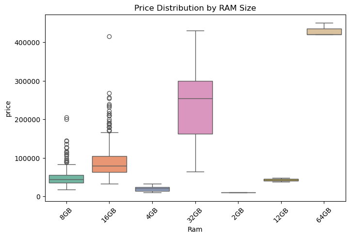
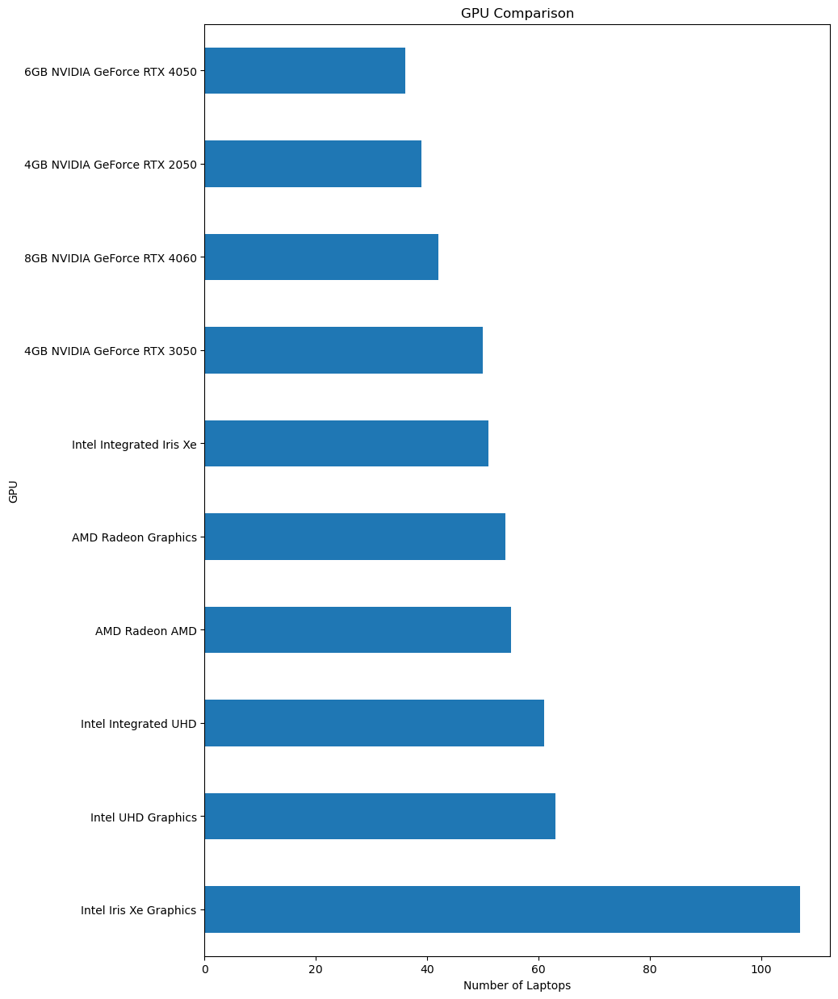

# 💻 Laptop Price Prediction - [Live Demo](https://your-live-demo-link.com)



## 📌 Project Overview
This project predicts the **price of a laptop** based on its specifications such as **brand, processor, RAM, ROM, GPU, OS, and display details**.  
It uses **Machine Learning (scikit-learn)** for training and a **Gradio UI** for interactive predictions.  

---

## 🔍 Exploratory Data Analysis (EDA)

Here are some insights from the dataset:

### 1️⃣ Laptop Brands Distribution


### 2️⃣ Price Distribution


### 3️⃣ RAM vs Price


### 4️⃣ GPU Comparison


---

## 🖼️ Gradio UI Screenshot
Below is the **Gradio Web App** interface for laptop price prediction:


---

## ⚙️ Features Used
- **brand** → Laptop brand (HP, Dell, Lenovo, etc.)  
- **name** → Model name  
- **spec_rating** → Overall specification rating (0–100)  
- **processor** → Processor family (Ryzen, Core i5, Core i7, etc.)  
- **CPU** → Core & threads details  
- **RAM / RAM type** → Memory size & type (DDR4, DDR5, LPDDR5, etc.)  
- **ROM / ROM type** → Storage size & type (SSD/HDD)  
- **GPU** → Graphics card  
- **Display size & resolution** → Screen details  
- **OS** → Operating System  
- **Warranty** → Warranty period  

---

## 🚀 Getting Started

### 1. Clone Repository
```bash
git clone https://github.com/Gokul-bit165/Laptop-price-prediction.git
cd laptop-price-prediction
```

### 2. Install Requirements
```bash
pip install -r requirements.txt
```

### 3. Run the Gradio App
```bash
python app.py
```
App will run locally on:  
👉 `http://127.0.0.1:7860`

---

## 🛠️ Tech Stack
- **Python 3.10+**  
- **pandas, numpy** → Data processing  
- **scikit-learn** → ML model training  
- **joblib** → Model persistence  
- **Gradio** → Interactive UI  
- **Matplotlib/Seaborn** → EDA & visualization  

---

## 📂 Project Structure
```
├── app.py                  # Gradio app
├── laptop_price_model.pkl  # Trained ML model
├── cleaned_data.csv        # Dataset
├── eda.ipynb               # EDA notebook
├── model-training.ipynb    # Model training notebook
├── requirements.txt        # Dependencies
├── images/                 # Screenshots & plots
│   ├── eda_brand_distribution.png
│   ├── eda_price_distribution.png
│   ├── eda_ram_vs_price.png
│   ├── eda_gpu_distribution.png
│   └── gradio_ui.png
└── README.md
```

---

## 🌐 Deployment
For deployment, you can use:  
- **Render** (recommended)  
- **Hugging Face Spaces**  
- **Heroku**  

### Example: Deploy to Render
1. Push code to GitHub  
2. Connect repo to Render  
3. Set **Start Command**:  
   ```bash
   python app.py
   ```
4. Add `requirements.txt`  

---

## 📌 Future Improvements
- Add **deep learning models** for better accuracy  
- Build **Streamlit / React frontend**  
- Extend dataset with **more laptop specs**  

---

## 🙌 Acknowledgements
- Dataset: Collected from online e-commerce laptop listings  
- Inspired by real-world laptop buyer decision support systems  
